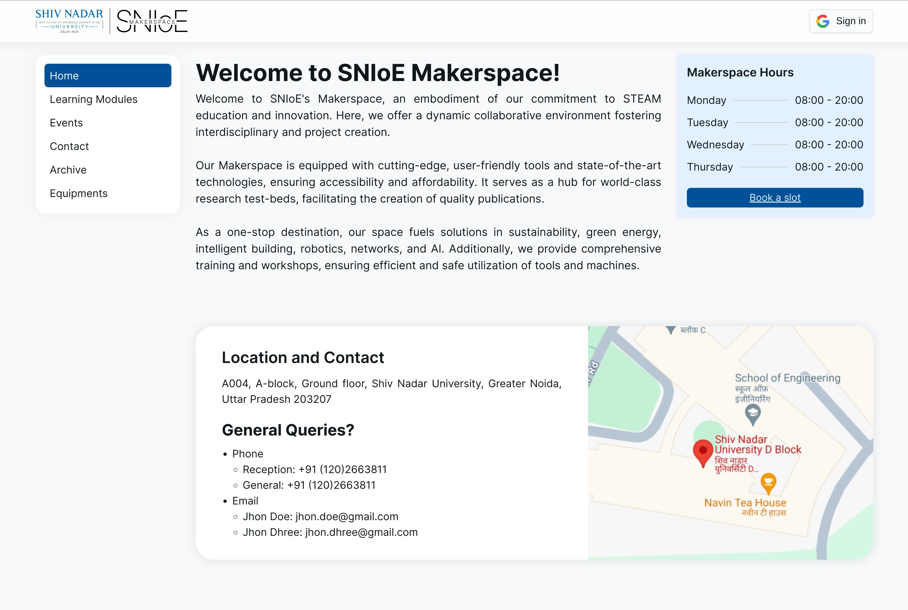
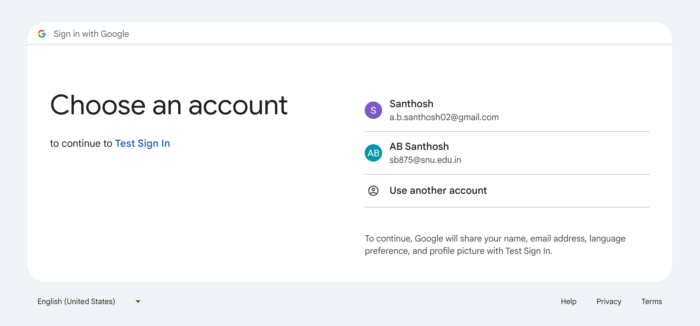
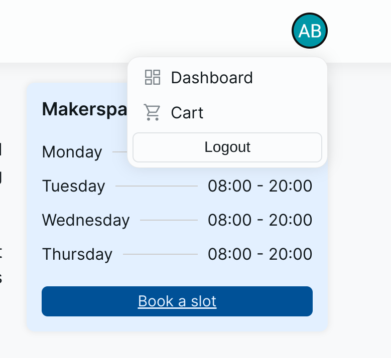
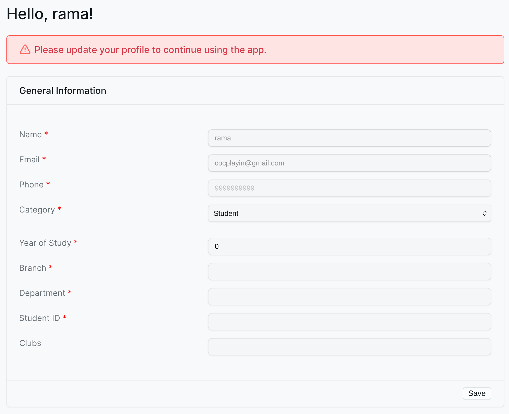
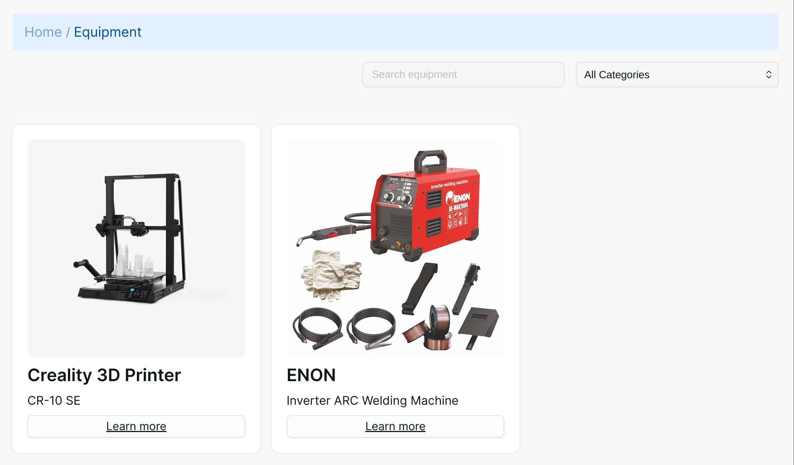
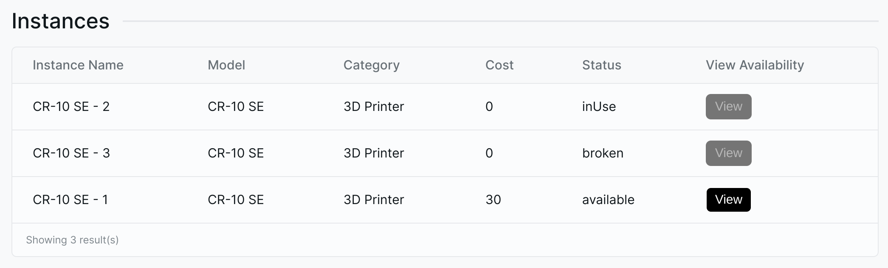
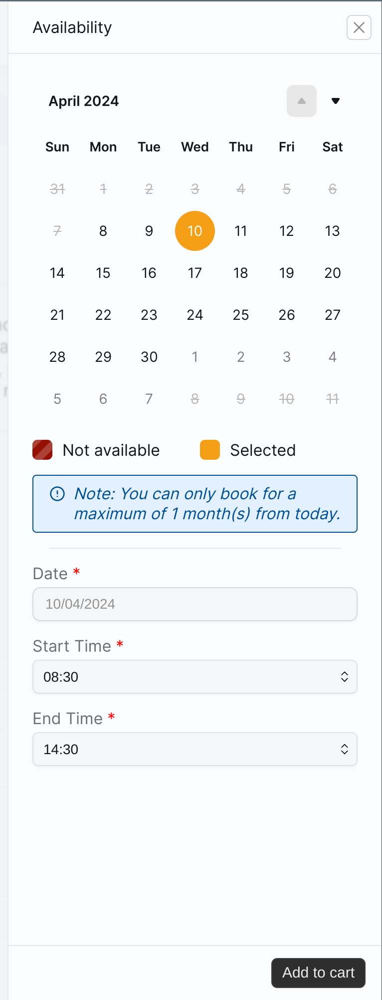
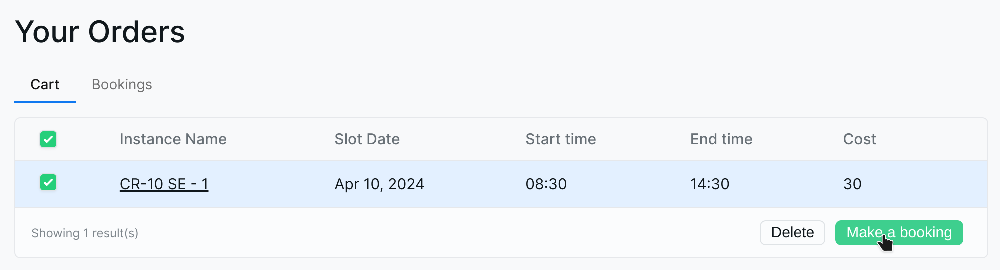
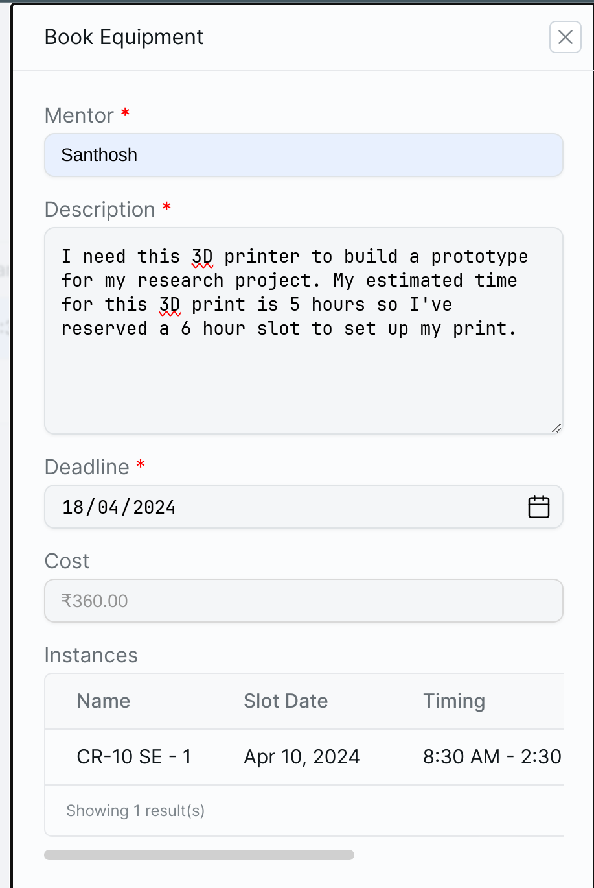

# End User Documentation for Makerspace Management System

Version 1.0  
Author: Santhosh

## Table of Contents

1. [Introduction](#introduction)
2. [Getting Started](#getting-started)

## Introduction

This document is intended to provide a comprehensive guide to the Makerspace Management System (MMS) for end users. The MMS is a web-based application that allows users to reserve equipment, view upcoming events, and more. This document will cover the following topics:

- [How to create an account](#creating-an-account)
- [How to reserve equipment](#reserving-equipment)
- [How to manage your cart and bookings](#managing-cart-and-bookings)
- How to view upcoming events (coming soon)
- How to contact support (coming soon)

## Getting Started

### Creating an Account

MMS requires users to create an account in order to access features such as equipment reservation. To create an account, follow these steps:

1. Go to the MMS website.  
   

2. Click on the "Sign In" button. Both new and existing users can sign in here.  
   

3. Choose your Organization account from the options provided. If your organization account is not listed, add it using "Use another account" and follow the prompts.

4. Now you are signed in to the MMS. To complete the account creation process, click on your profile icon in the top right corner and select `Dashboard`.  
   

5. In the Dashboard, you will be prompted with a form to fill in your personal details. Select your category from the dropdown, fill in the required fields and click `Save`.  
   

6. Now you'll be able to make reservations for equipment in Equipments page!

### Reserving Equipment

To reserve equipment, follow these steps:

1. Go to the Equipments page by clicking on the "Equipment" in the navigation bar and select the equipment you want to reserve.  
   

2. Select on of the available instances of the equipment by clicking on the `View` button.
   

3. Here, you can see the availability of the instance.

- Select a date you want to reserve for
- Select the start time and end time for your slot
- and click on `Add to Cart`.  
  

### Managing Cart and Bookings

1. Once you've added all the equipment you want to reserve to your cart, click on the user profile icon in the top right corner and select `Cart`.

2. In the Cart page, you can see all the equipment you've added to your cart. Select the equipment you want to reserve and click on `Make a Booking`.  
   

3. Fill in the required details in the pane and click on `Book`. Please make sure to fill in appropriate details to ensure your booking verification is timely.  
   

4. Your booking is now placed! You can view your bookings in the `Bookings` page.

5. Now you have to wait for the admin to approve your booking. Once your booking is approved, you will receive a confirmation email.

6. (Optional) Some items might require a fee to operate. You can pay the fee through the QR code provided in the `Bookings` page and enter the payment id provided to you in the `Bookings` pane.
